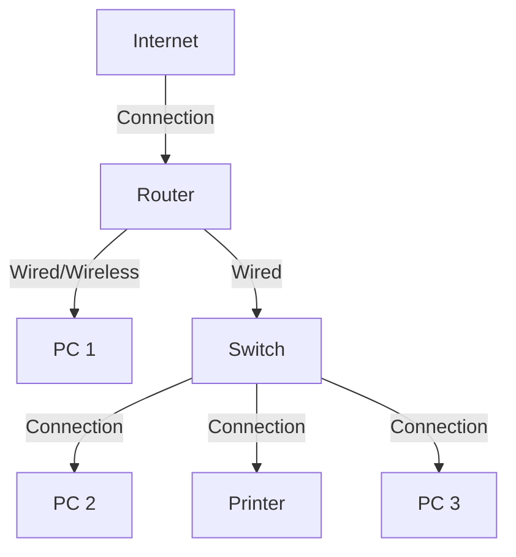

# Introduction to Networking

## What is Networking?
Networking is the process of connecting computers and other devices to share information and resources. It allows communication between devices using different technologies like wired and wireless connections.
---
---
### Basic Networking Diagram


### **Explanation of the Basic Network Diagram**  

The diagram represents a **simple office or home network**, showing how different devices connect to communicate and access the internet. Here’s how it works:  

1. **Internet** → The network starts with an internet connection from an Internet Service Provider (ISP).  
2. **Router** → The router connects to the internet and acts as the central hub of the network. It manages traffic between devices and can connect to both wired and wireless devices.  
3. **PC 1** → This computer is directly connected to the router, either through Wi-Fi or an Ethernet cable.  
4. **Switch** → A switch is used when multiple devices need to be connected via a wired network. It expands the number of available ports beyond what the router provides.  
5. **PC 2, PC 3, and Printer** → These devices connect to the switch, allowing them to communicate with each other and access shared resources like the printer.  

### **Key Points:**  
- **The router connects the internal network to the internet.**  
- **The switch helps connect multiple wired devices.**  
- **Devices in the network can communicate, share files, and access the internet.**  
- **A printer can be shared among multiple users in the network.**  

This setup is commonly used in **homes, small offices, and businesses** to efficiently manage internet and resource sharing.
---

---
## When and Who Created Networking?
The concept of networking began in the 1960s with the creation of ARPANET (Advanced Research Projects Agency Network), developed by the United States Department of Defense. This network laid the foundation for the modern internet by enabling communication between computers at different locations.

### Example and Diagram

```
[Computer A] ---- [ARPANET] ---- [Computer B]
```

ARPANET used packet-switching technology, which became the standard for modern networking.

---

## Key Takeaways
- Networking connects devices to share data and resources.
- It can be wired (Ethernet) or wireless (Wi-Fi, Bluetooth).
- ARPANET was the first network, leading to the internet.
- Understanding networking is crucial for cybersecurity and IT.

---

## Why is Networking Important for Cybersecurity?
Networking plays a crucial role in cybersecurity because:
- **Understanding Threats:** Hackers exploit network vulnerabilities.
- **Secure Configuration:** Properly configured networks reduce risks.
- **Traffic Monitoring:** Analyzing network traffic helps detect cyberattacks.
- **Firewalls & IDS/IPS:** Security devices rely on networking knowledge.

---


## Conclusion
Networking is the backbone of modern communication and cybersecurity. Understanding its fundamentals helps in securing networks, detecting threats, and managing data transmission efficiently. Mastering networking is a crucial step for anyone interested in IT, cybersecurity, or ethical hacking.

---

> **Note:** Also, check other blogs for more networking concepts.  
> More topics will be added in the coming days to expand your knowledge of networking. Stay tuned!

